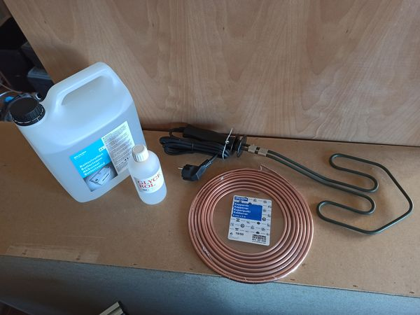
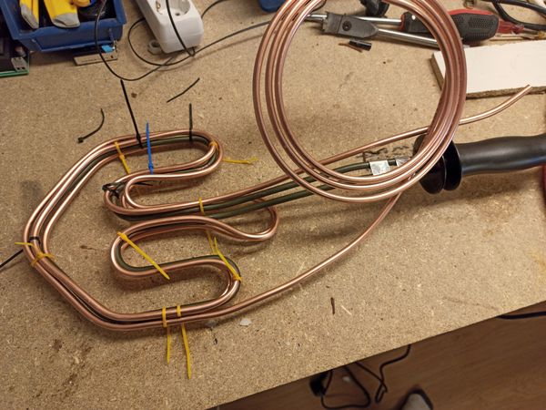
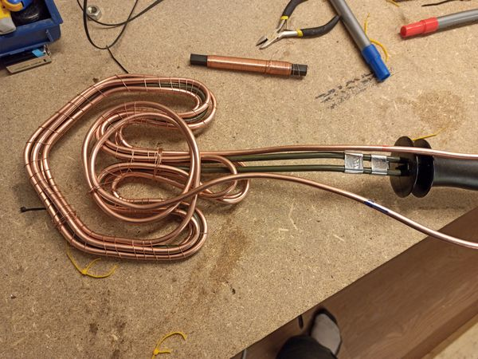
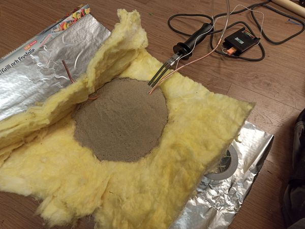
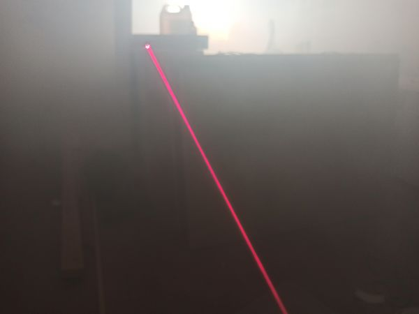

# Fogger
A cheap DIY fog machine.

## Hardware
The basic fog machine consists of
* Grill lighter, $15
* Copper fuel pipe (6mm outer diameter, 5m long), $22
* Thermocouple thermometer, $4
* Pump (self priming, 6mm outer diameter inlet and outlet, 12V), $4
* 12V adapter, $3
* PVC tube (5mm inner diameter), $3
* Aluminium foil
* Metal wire
* Rockwool insulation
* About 1 liter of sand
Total cost: $51 (assuming you have the last four items on the list, if not rockwool might be the hardest to come by in small quantities)

The upgraded version with automatic temperature control, display and WiFi remote control removes the "manual" thermocouple thermometer and adds these things:
* Wemos D1 mini (ESP8266) $3
* MAX6675 Module + K Type Thermocouple, $5
* 2 channel relay module (3.3V), $3
* 5V charger, $2
* OLED display (0.91", 128x32, I2C), $2
Total cost for upgraded version: $62

Fog juice (smoke liquid) is made from
* Destilled water (4L), $4
* Glycerol (1L), $16
Total cost for 5L of 20% fog juice: $20
Fog juice can also be bought premade for about the same price but then you can't vary the concentration as easy.

Some of the stuff needed

Carefully bend the copper pipe to follow the shape of the grill lighter. Mine was able to go three loops along the whole heater element with a few decimeters to spare on each end. I used cable ties to keep the pipe in place as I was bending it.

The cable ties are replaced with a tight wiring of metal wire.

The thermocouple is wired so that the business end is close to the center of the heater without touching any metal. Then the whole thing is placed on a sheet of rockwool (5-10cm thick) and sand is poured ontop (to act as heat distribution and storage). The rockwool is then folded over to make a insulated package and the whole thing is wrapped in aluminium foil.

Connect the outlet of the pump to the copper pipe using a PVC tube and on the inled put another tube that leads to a container of fog juice. For the manual version you then plug in the heater and when the temperature reaches 260 degrees celcius on the thermocouple thermometer you can turn off the heater. Turn on power to the pump for a while and enjoy the smoke! When the temperature drops below 250 degrees again you can plug the heater in for a while until it reaches 260 degrees again. The system has quite a bit of thermal lag so if you turn off the heater at 260 degrees it overshoots to about 295 degrees in my setup.

Video of first testrun.

